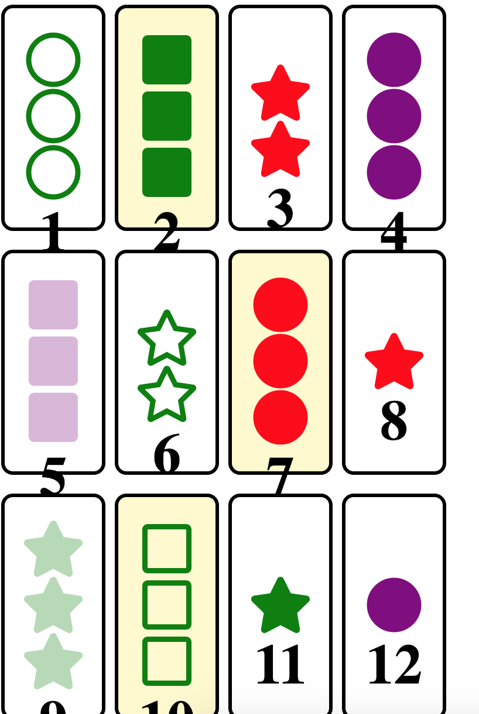

Live demo: https://tokyosuite.github.io/set-game/

My goal is to work on the project in chunks over the next few days, and not to attempt to complete this in one sitting (as doing so is pretty energy and brain-power draining). My estimated time is 3-5 days on this project, 2 or 3 hours each day. I'll also chronicle the stuff I learned for each day. I think this will be a good change of pace, and a venture into a different style of doing projects. 

### 1/17: Finished the creation of the Set Deck (Model.js) - the model component behind the app.  
* Sketched out the idea behind the app. There should be <b>3 main components</b>: 

  * <b> App.js </b>: This will hold the state of the overall application. It will be a place which keeps track of <b>where</b> in the deck the player currently is. It will also contain functions which: 
  
    * Check whether or not the 3 cards selected contribute a VALID set. It will likely be a function that contains four smaller check functions, one for each "type". For example, CHECK 1: Passes if all colors are different OR all colors are the same, CHECK 2: Passes if all shapes are different or all shapes are the same, etc. 
    * If the set is VALID, then (1) award a point and (2) remove and replace the three chosen cards with three new ones. Back in the state, this involves identifying (using an index of some sort) the exact cards removed and filling them with the next cards in line. 
    
  * <b> Card.js </b>: This is strictly a presentational component. The symbols displayed in the UI do not have to align exactly with those in the model (e.g. we could use "orange", "blue" and "black"), as long as they remain consistent. The sole job of this component is to display a single Set card. 
  
  * <b> Model.js </b>: (Completed ?) This component is (tentatively) completed. This initiates the deck by creating the cards and "shuffling" them. 
  
  
### 1/18: Finished displaying the cards physically on screen. However, having a bit of difficulty lifting the child state onto the parent state - where I plan to keep all the logic pertaining to the game. 



The CSS rendering logic was kind of neat, I thought. I decided to use Font Awesome icons, since they closely resemble the original Set cards. The good thing about CSS styling + React is that you can <b>use Javascript to have flexible CSS styling</b>. So depending on the state of the card (which is a single element in our original array that contains properties like the color of our card, the number of elements, etc.), we can use bracket notation to denote the styling the element will eventually receive. 

The difficulty that I need to figure out is how to determine exactly which cards the player touched. I currently have the individual Card component as stateful (NOT what I want), and its easy to just write something like: ```state = { selected: false }```, and then use an <b>onClick</b> method to have ```this.setState({ selected: !this.state.selected })```. However, when we lift the state back up to the parent, instead of a single element, we need to write something like ```state = { selected: Array(12).fill(false) }```. Then, upon selecting a card, we need to keep track of that index and <b>that element in the array</b> to be true. 

Might come back to this tonight.


